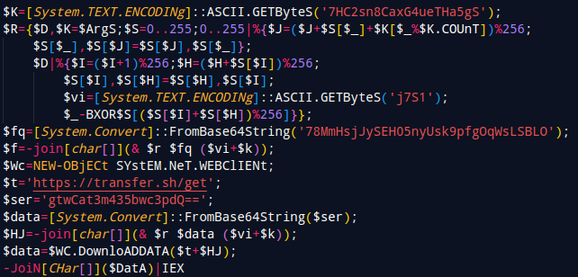
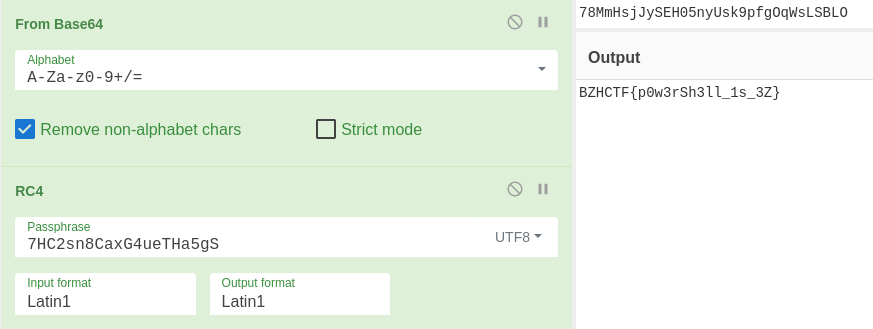

BreizhCTF 2023 - BreizhCrêpes
==========================

### Challenge details

| Event                    | Challenge  | Category       | Points | Solves      |
|--------------------------|------------|----------------|--------|-------------|
| BreizhCTF 2023           | BreizhCrêpes  | Forensique  | 374    | 54         |

BreizhCrêpes est une entreprise spécialisée dans la production de crêpes salées (miam).
Gurvan, l'administrateur système de l'entreprise, reçoit un appel d'un collaborateur. Il s'agit de Gweltaz qui indique avoir cliqué sur un e-mail suspect.
L'e-mail semble provenir d'un fournisseur de confiance TrueBreizhButter (producteur de beurre doux) et l'incite à ouvrir un fichier pour vérifier une facture en attente de paiement.

### TL;DR

Il s'agit d'un document Excel malveillant utilisé pour obtenir un accès initial à la machine. À partir de la macro contenue dans le fichier, il est possible de récupérer un code PowerShell (basé sur le stager d'*Empire*) possédant des chaînes de caractères chiffrées en RC4.

### Méthodologie

Deux méthodes sont possibles pour désobfusquer la macro, soit téléverser le fichier dans une sandbox, soit à la main ce qui est un plus long. En la mettant dans [hybrid-analysis](https://www.hybrid-analysis.com), on obtient un script PowerShell.

Une fois formaté, on peut voir qu'il y a une opération xor (`BXOR`), probablement utilisé pour chiffrer les chaînes de caractères présente dans le script.

En recherchant sur Internet le bout de code relatif au chiffrement, on trouve qu'il s'agit d'un stager PowerShell *Empire* utilisant un chiffrement RC4 avec `$K` étant la clé.

En déchiffrant la première chaîne de caractère, on obtient le flag.

> Afin d'éviter de simplement mettre le fichier dans une sandbox et récupérer l'url final, le flag a été mis dans une variable non utilisé du script.

# Flag

`BZHCTF{p0w3rSh3ll_1s_3Z}`
